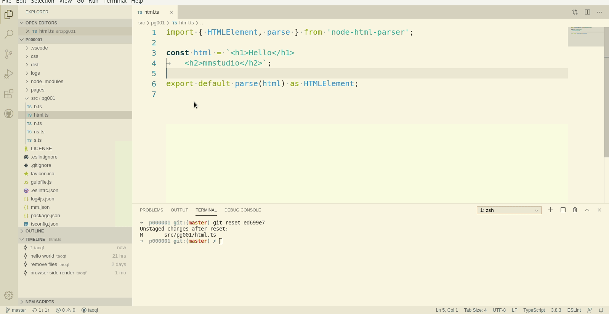

# Git简介

今天我们来聊一聊Git这个东西，在[前面的课程](./000003#Git)中，我们提到了它，我们用它来进行代码的版本管理，在创建工程时也会使用到它，并且你创建的软件工程需要一个远程的仓库来存储。有几种选择：

1. 如果工程代码没有什么需要保密的，[github](https://github.com),[码云](https://gitee.com)都可以，如果工程代码保密性要求比较高，可以考虑以下几种方式
1. 参与开发的人数较多并且代码不宜公开，建议自己搭建一个gitlab的服务器，使用docker也是很方便的
1. 如果参与开发的人数不超过5个，可以考虑使用[码云](https://gitee.com),国内使用速度还是不错的。如果开发人员较多，收费的企业版也还行。
1. 个人测试用的话，[码云](https://gitee.com)也是一个不错的选择

## 克隆仓库

记住clone命令吧，这个我个人觉得比在vscode里的git clone命令来得方便一点儿，用多了记住也不难，当然如果你记不住，vscode里命令行里输入git后列表里也能找得到的，向导式的，我也见过有不少人用的，能行。

## 提交代码

这一点与svn和sourcesafe稍有不同，提交提的是本地仓库的提高，后面还需要同步一下才行。

小提示：

如果你是老手，可能会需要修改一下提交的快捷键`alt+s`，以前版本的vscode默认就可以的，不知道什么时候开始不行了，`ctrl+Enter`需要两只手配合，用起来个人觉得不大方便。

## 同步

其实就是pull和push命令用着也还行，不过呢，还真没有集成工具里点个小圈圈（其实是两个箭头合抱的一个开关）方便

在vscode打开一个git项目后，状态栏的最左侧显示的有git的分支和与远程仓库的同步情况，一个简单的操作就是手勤快一些，见到有数字就去点一下，这样你的代码与同小组的开发的同事们的冲突就会降到最低

小提示：

如果点小圈圈出错了，很有可能是你的代码已经与远程仓库里的代码出现冲突了，而这时如果你工程中有冲突的这个文件被编辑但未提交，这时是会有错误提示的，如果出现了错误提示，不要急不要慌，也不要急着把它关掉，可以点击按钮查看详细的错误信息，这样更便于解决问题。通常这种情况下，把本地的有冲突的代码提交或在工程外备份都可以。可能对于新手，在工程外备份的方法也许更方便。

## 冲突

多人协作时，代码产生冲突是不可能完全避免的，如果出现了，每次都在工程外备份，然后拉取后再修改的法子实在是不方便，因为有时候修改的东西多了，手动的方法可能会有遗漏的。解决冲突在vscode里其实也并不是很麻烦：

所有冲突文件和冲突位置全部修改后即可提交，再同步就OK啦。

## 您的支持是我继续的动力

