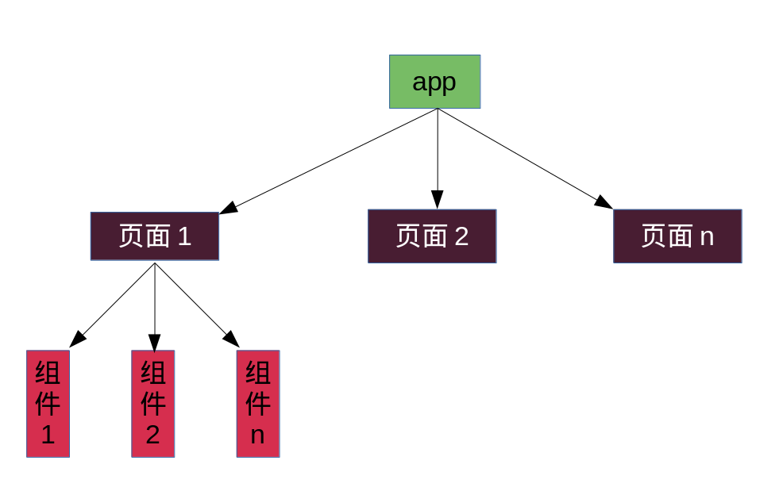
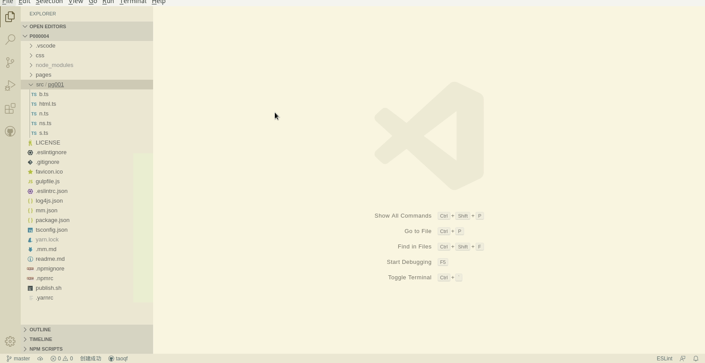

# 组件

## 什么是组件

我们先来看看[百度百科](https://baike.baidu.com/item/%E7%BB%84%E4%BB%B6)上面的解释：`组件（Component）是对数据和方法的简单封装。`，在我后面的课程中，`组件`指的是一个在页面结构上包含独立的数据和业务逻辑的单元，只在web页面存在`组件`概念，在app应用和微信小程序应用中，因其页面较小，从设计上来讲，多数页面的逻辑不宜过于复杂，所以不需再划分组件。

它们的结构可以用下图表示:



学徒这里划分组件的概念与react的组件的概念是不一样的，react的组件实际上在学徒设计的这个框架中只是个控件的概念，组件和控件的区别在于：组件中包含有业务逻辑，而控件中往往只是将一个功能封装成的独立单元。

## 组件划分的依据

一个页面，如何划分组件呢？这其实是一个非常难以回答的问题，因为它没有一个固定的标准，一个页面，划分为a,b,c可以，划分a,b也行，甚至有些页面逻辑简单，可以只划分一个组件a也不是不可以（事实上，移动应用上不划分组件就可以看作是这种极限的划分方式）。

通常来说，一个没有严格依据的事情办起来就是比较难的，这虽然符合中国人的逻辑，但不得不说，偏西方的严格细化的科学思想的确是适合当今的工业化的。

虽然学徒不能给出一个严格的组件划分标准，但是可以给出一些大致的划分依据：

1. 页面布局，如页头，页尾
1. 业务逻辑集中，如表单，列表

这个问题我咨询了几个有多年开发并且有使用组件经验的人，这里引用其中一段原话：

> 如果已经比较习惯组件划分的话，会认为有组件会比较清晰，当然，比较熟悉组件的人也不会很纠结组件的划分

## 示例

[点击查看完整示例](https://github.com/mm-works/p000004)

我们以[Hello World](https://github.com/mm-works/p000001)来作示例说明。

这个页面中包含了两部分，一部分是`Hello`，另一部分是`World`

```html
<h1>Hello</h1>
<h2>World</h2>
```

如上所述，我们可以任意划分组件（但必须保证划分的组件中的内容是完整的html片段），为了更好地说明组件划分，我准备将这个页面中的Hello划分为一个组件，World划分为第二个组件（甚至，我还可以划一步划分一个空的片段作为第三个组件）。其操作步骤如下：

1. `ctrl+p`，输入`html`,快速打开`src/pg001/html.ts`
1. 选中`<h1>Hello</h1>`，使用快捷键`alt+c`创建组件`zj-001`
1. `ctrl+p`，输入`html`,快速打开`src/pg001/html.ts`
1. 选中`<h2>World</h2>`，使用快捷键`alt+c`创建组件`zj-001`

这样，我们的组件就划分完了



## 您的支持是我继续的动力


