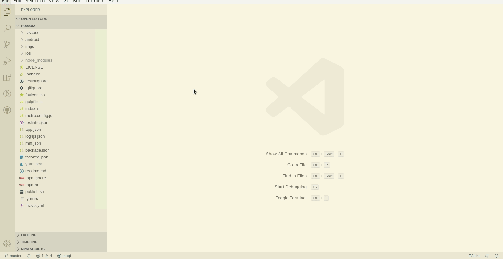
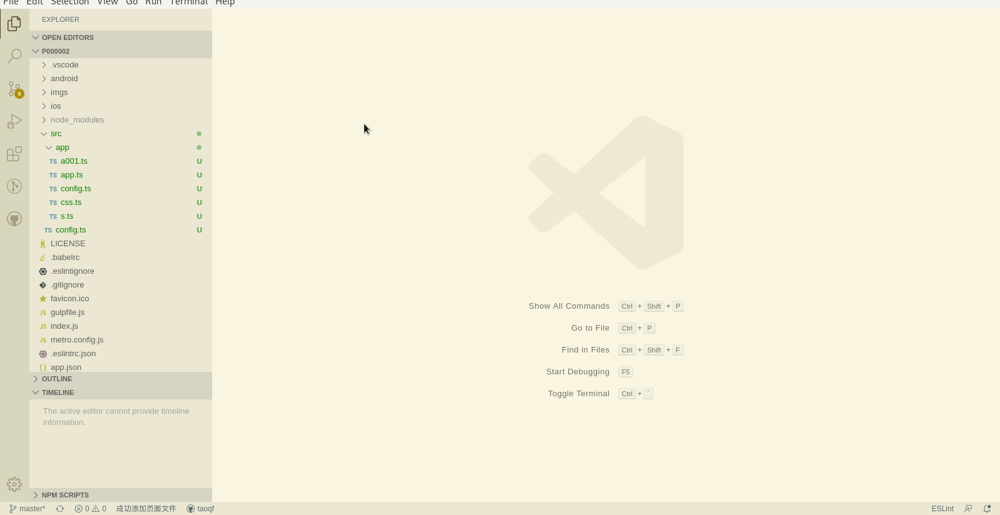
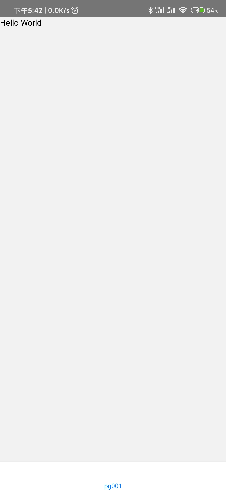

# Hello World

该项目完整代码位于[github](https://github.com/mm-works/p000002)

## 创建项目

创建项目过程类似[web端](../web/000001)，地址为<https://github.com/mm-works/p000002>.


小技巧：在很多选择项时学徒添加了数字编号，像以上创建项目时，项目类型可以键盘输入`2`，便可快速进行选择。比纯粹方向键要好用一些。后期教程中，学徒将带领各位看官尽量使用键盘操作，以加速工作效率。

## 页面的类型

- [app](#app)
- [容器类型页面](#容器类型页面)
- [普通页面](#普通页面)

### app

它其实是一个应用的总容器，它里面可以包含更多的容器或页面

### 容器类型页面

我们使用容器来进行页面地图的组织，容器类页面无tpl，本身不展示，只是普通页面的组织者。我们用`c`来作为它们的名称前缀的标识，这里没有放置效果图，不过以下链接打开后是可以看到效果图的。

类型|描述
---|---
[压栈式](https://reactnavigation.org/docs/stack-navigator)|压栈式页面组织，一个页面叠压到另一个页面上面
[侧边划出式](https://reactnavigation.org/docs/drawer-navigator)|可使用手势从一侧拖动打开和关闭页面
[底部tab页](https://reactnavigation.org/docs/bottom-tab-navigator)|常用的主页显示形式，底部为tab页，可切换
[增强型底部tab页](https://reactnavigation.org/docs/material-bottom-tab-navigator)|底部为tab页，带手势特效，延迟加载
[顶部tab页](https://reactnavigation.org/docs/material-top-tab-navigator)|顶部为tab页，带手势特效，延迟加载

### 普通页面

用来展示的页面，主要的业务逻辑及用户交互都在这里进行。我们用`pg`作为它们的名称前缀的标识，这一点与web页面相同。如果你会进行web页面开发之后，进行移动应用的开发的学习代价并不很高。

## 创建app

创建页面的过程类似[web端](../web/000001)，但第一个页面的步骤稍麻烦一些，毕竟它是一个app，我们先用创建页面的命令创建app：



在实际应用中只有一个单页面的应用并不常见，即便有，这种模式依然可用。

## 创建页面

打开`src/app/app.ts`，使用命令或快捷键创建页面，并开启调试



创建完页面后，在自动打开的tpl.tsx中，添加一个显示文本：

```tsx
<Text>Hello World</Text>
```

修改的tpl完整内容如下：

```tsx
import am1 from '@mmstudio/am000001';
import React from 'react';
import { Text } from 'react-native';

export default function tpl(a: <T>(action: string, ...args: unknown[]) => ((...args: unknown[]) => void), s: (...class_names: string[]) => {}, d: <T>(d: string, v: T) => T, mm: am1) {
	return (<>
		<Text>Hello World</Text>
	</>);
}
```

小提示：

1. 快捷键也可以使用`alt+c`，因为在移动应用上没有组件概念，使用创建组件的快捷键也可以创建页面（相比来说，`alt+c`使用更方便一些，单手可操作。
1. `alt+c`快捷键与默认的vscode搜索选项匹配大小写有冲突，解决的办法是，打开菜单`File->Preferences->Keyboards shortCuts`,输入`toggleFindCaseSensitive`,选中搜索结果（完全匹配的那一行），按下`Delete`键即可（如果有必要，也可以改成其它的快捷键）。
1. 创建页面不一定打开`src/app/app.ts`，打开任何一个位于`src/app/`下的文件都可以。
1. 打开文件可以使用快捷键`alt+p`操作效率更高

### 移动应用调试

学徒没有mac电脑，只能做android的开发和测试，通常，功能性的测试在android上进行就可以了，很方便。

如果要进行移动应用的开发和调试，必须[将anroidsdk和jdk设置好](../lessons/000003#JDK+AndroidSDK)

调试建议使用真机调试，现在使用真机调试的代价并不高，没有必要使用模拟器测试，使用模拟器不仅速度慢，有些功能还无法（或是非常困难）完全模拟测试。但学徒也还真遇到过有些机型进行测试非常费劲的，如果真的遇到这种情形，建议借一台android机测试（哈哈，这个办法不错吧？但是，如果开发机性能够好，且开发者有使用android模拟器的经验，事实上，也可以使用模拟器，但真心不推荐）。

真机测试需要将系统调整为[开发者模式](#开发者模式的打开方法)。

启动调试后，在手机上应用界面如下：



## [再添加一个tab页](./000002)

## [显示标题+初始显示页](./000003)

## 调试可能会出现的几种问题

1. 无法启动文件监听解决办法

	- 错误信息

	```sh
	events.js:165
		throw er; // Unhandled 'error' event
		^

	Error: watch /home/taoqf/p000001/dist/ ENOSPC
		at FSWatcher.start (fs.js:1402:19)
		at Object.fs.watch (fs.js:1428:11)
		at createFsWatchInstance (/home/taoqf/p000001/node_modules/_chokidar@1.7.0@chokidar/lib/nodefs-handler.js:37:15)
		at setFsWatchListener (/home/taoqf/p000001/node_modules/_chokidar@1.7.0@chokidar/lib/nodefs-handler.js:80:15)
		at FSWatcher.NodeFsHandler._watchWithNodeFs (/home/taoqf/p000001/node_modules/_chokidar@1.7.0@chokidar/lib/nodefs-handler.js:228:14)
		at FSWatcher.NodeFsHandler._handleDir (/home/taoqf/p000001/node_modules/_chokidar@1.7.0@chokidar/lib/nodefs-handler.js:407:19)
		at FSWatcher.<anonymous> (/home/taoqf/p000001/node_modules/_chokidar@1.7.0@chokidar/lib/nodefs-handler.js:455:19)
		at FSWatcher.<anonymous> (/home/taoqf/p000001/node_modules/_chokidar@1.7.0@chokidar/lib/nodefs-handler.js:460:16)
		at FSReqWrap.oncomplete (fs.js:171:5)
	Emitted 'error' event at:
		at FSWatcher._handleError (/home/taoqf/p000001/node_modules/_chokidar@1.7.0@chokidar/index.js:257:10)
		at createFsWatchInstance (/home/taoqf/p000001/node_modules/_chokidar@1.7.0@chokidar/lib/nodefs-handler.js:39:5)
		at setFsWatchListener (/home/taoqf/p000001/node_modules/_chokidar@1.7.0@chokidar/lib/nodefs-handler.js:80:15)
		[... lines matching original stack trace ...]
		at FSReqWrap.oncomplete (fs.js:171:5)
	npm ERR! Test failed.  See above for more details.
	```

	- 解决办法，复制以下命令在端口执行一次即可：

	```sh
	echo fs.inotify.max_user_watches=524288 | sudo tee -a /etc/sysctl.conf && sudo sysctl -p
	```

1. 8081端口被占用

	执行`lsof -i :8081`将查询到的进程全部使用`kill 进程号`终止即可。

1. 调试出现白屏

	在第一次进行app应用调试时，总是会出现白屏的。解决办法为将该应用进程杀掉，重新打开就好了。

## 开发者模式的打开方法

### 小米手机

- 打开手机系统设置
- 进入“我的设备”
- 进入“全部参数”
- 连续点击“Android版本”，直到提示已经成功打开开发者模式
- 重新打开系统设置
- 进入“更多设置”
- 进入“开发者选项”
- 确保“开启开发者选项”，“不锁定屏幕”，“USB调试”，“USB安装”

### 附荣耀10

- 打开"设置"
- 进入"系统"
- 进入"关于手机"
- 连续点击"版本号",直到提示已经成功打开开发者模式
- 重新打开设置
- 进入“开发者人员选项”
- 确保“开启开发者选项”，“不锁定屏幕”，“USB调试”，“USB安装”

### 附OPPO r9s

- 打开"设置"
- 进入"关于手机"
- 连续点击"版本号",直到提示已经成功打开开发者模式
- 重新打开设置
- 进入“更多设置”
- 进入“开发者选项”
- 确保“开启开发者选项”，“不锁定屏幕”，“USB调试”，“USB安装”

## 您的支持是我继续的动力


