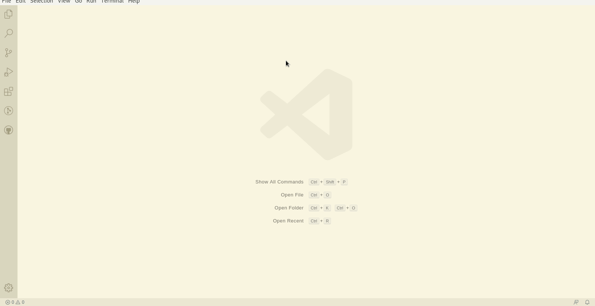

# Hello World

该项目完整代码位于[github](https://github.com/mm-works/p000002)

## 创建项目

创建项目过程类似[web端](../web/000001)，地址为<https://github.com/mm-works/p000002>.

这里介绍一个小技巧：在很多选择项时学徒添加了数字编号，像以上创建项目时，项目类型可以键盘输入`2`，便可快速进行选择。比纯粹方向键要好用一些。后期教程中，学徒将带领各位看官尽量使用键盘操作，以加速工作效果。

## 打赏

