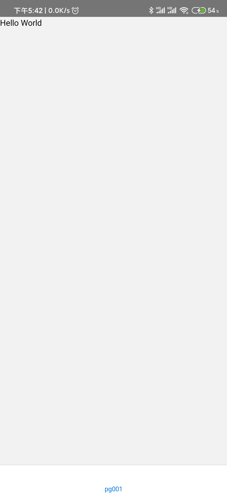
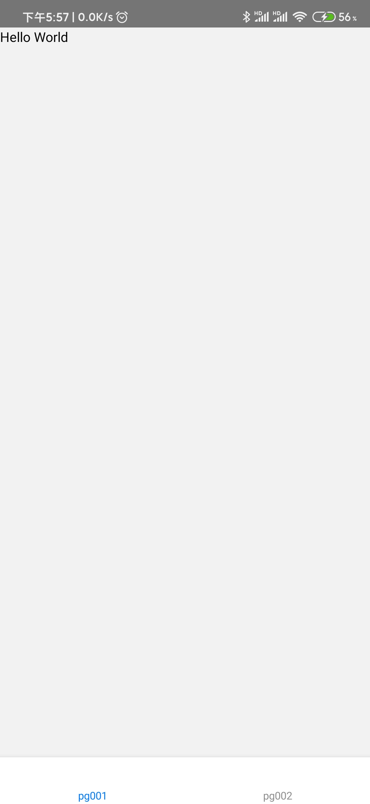

# 再添加一个tab页

上一节我们添加的[hello world](./000001)启动调试后，是这个样子的：

可以看到，tab页只有一个，让我们再添加一个，顺便也巩固一下前面学到的内容

1. 打开`src/app/app.ts`，使用命令或快捷键新建页面
1. 添加显示内容`Hello mmstudio`
1. 保存

保存后，可以直接在调试手机上看到，tab页多了一个

小提示:

1. 如果在此过程中手机与电脑断开了，重新开启调试即可

## [显示标题+初始显示页](./000003)
