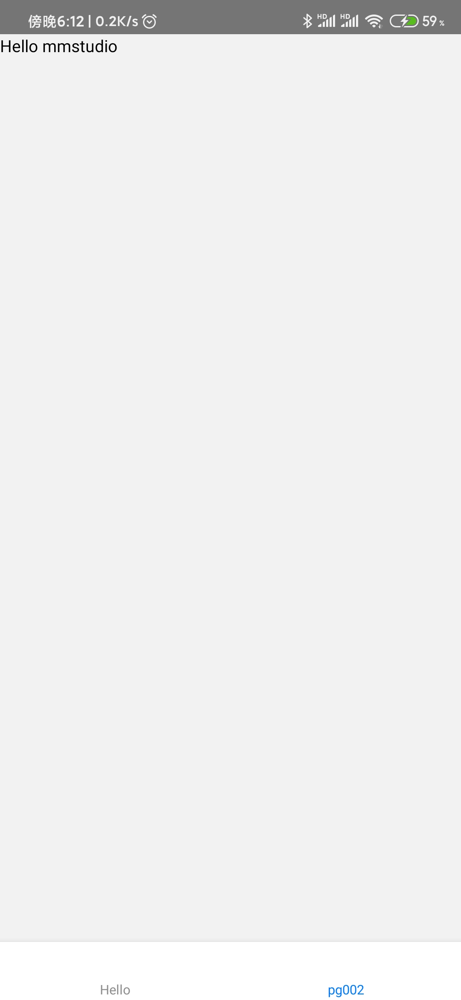

# 显示标题+初始显示页

上一节我们给[hello world](./000002)添加了两个页面，但是标题显示也太难看了：


## 修改显示标题

我们试着修改下面tab标签上的文字`pg001`为`mmstudio`.

1. 打开`src/pg001/config.ts`
1. 添加配置`title: 'Hello'`，修改后的内容如下

	```ts
	import { PageConfig } from '@mmstudio/mobile';

	export default {
		title: 'Hello'
	} as PageConfig;
	```

1. 保存

小技巧：

这次保存之后，手机端并没有什么变化，这个时候我们需要重新加载整个应用才能生效，具体操作为：

1. 鼠标点击选中名字为`debug app`的终端（这时它应该就在vscode的下方）
1. 按下键盘的r键（如果你用的中文输入法，需要先切换回来）

## 修改默认显示第二个tab页

如果我们希望默认显示第二个tab页怎么办呢？添加一个配置即可.

1. 打开`src/app/config.ts`,（注意添加配置的位置在`src/app`而非`src/pg002`中）
1. 添加默认显示的页面配置`initialRouteName: 'pg002'`.完整代码如下：

	```ts
	import { AppConfig } from '@mmstudio/mobile';

	// see [readme](vscode://readme.md) for more details
	export default {
		initialRouteName: 'pg002'
	} as AppConfig;
	```

1. 重新加载应用生效


