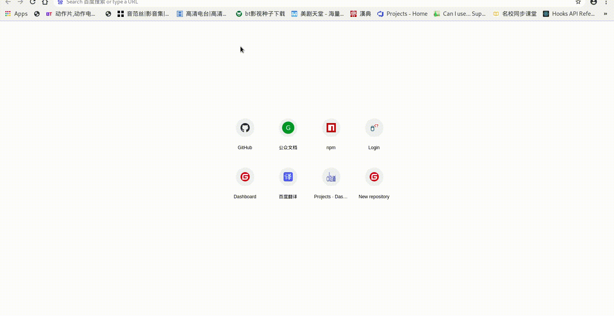

# 你好

怎样用编程的方法说“你好”呢，在我们什么都不懂的情况下，我们先来尝试一下把这个“你好”打印出来，既然我们是零基础，那么我们就先不管什么理论不理论的，先来个效果看看。

## 步骤

1. 我们先要准备一台电脑
1. 安装一个Google的浏览器，启动打开它
1. 找到键盘上的F12键，应该就在键盘右上部的位置，按下这个键
1. 使用鼠标选中下面一行文字

	```js
	alert('你好');
	```

<script>
function copy2clipboard(text) {
	return new Promise((resolve, reject) => {
		const textArea = document.createElement('textarea');
		textArea.setAttribute('style', JSON.stringify({
			background: 'transparent',
			border: 'none',
			boxShadow: 'none',
			height: '2em',
			left: 0,
			outline: 'none',
			padding: 0,
			position: 'fixed',
			top: 0,
			width: '2em'
		}));

		textArea.value = text;
		document.body.appendChild(textArea);
		textArea.select();

		try {
			const successful = document.execCommand('copy');
			if (!successful) {
				reject(new Error('copy command unavailable'));
			} else {
				resolve();
			}
		} finally {
			document.body.removeChild(textArea);
		}
	});
}

async function f(){
	await copy2clipboard(`alert('你好');`);
	alert('已复制');
}
</script>
<input type='button' onclick=f() value='点击复制代码' >

1. 粘贴并运行(按下回车键即可运行),将会弹出提示框，内容为"你好"

## 示例



## 练习

尝试修改一下显示的内容并回车运行。

## 总结

这只是一个查看效果的示例，万丈高楼平地起，只要能挑起各位老师们对于编程的兴趣就可以了。详细的内容我们以后有机会再讲。


