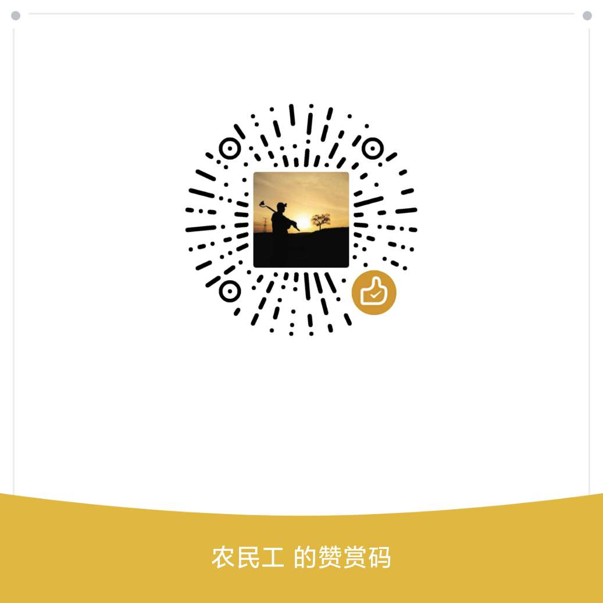

# 二进制

## 半斤八两

有一个成语叫`半斤八两`，我们日常可能也经常会这么说，但是`半斤`并不等于`八两`啊？

事实上，在古代，`半斤`是等于`八两`的，因为古时候的一斤并不是10两，而是16两，所以，半斤就是8两。这其实就是16进制。

我们现在在实际当中，10进制用地最多，其实我们生活当中，非十进制也有在用，只是我们不注意罢了。比如时间，也不是10进制。时分秒是60进制。年和月是12进制，月和日是30或31进制。角度我们使用360进制，360度是一圈。

## 2进制

在计算机中，我们使用2进制，即满2就进1.我们用一张对照表来看一下：

二进制|十进制
---|---
0|0
1|1
10|2
11|3
100|4
101|5
110|6
111|7
1000|8
1001|9
1010|10

从上表可以看出，2进制表示数字非常麻烦，一个10进制的数字（比如9）竟然用好几个数字来表示（4个）。既然2进制非常麻烦，那我们为什么还要使用它呢？

仔细看，虽然2进制用来表示数字的数字用地非常多，但它只使用0和1的组合就可以表示任意数字，并不需要第三个数，这就是它的优势所在，我们中国的易学讲`易有太极，是生两仪，两仪生四象，四象生八卦。`，在计算机领域中的0和1,其实就是`两仪`，是现代计算机科学能深入的最低最细的层级了。`太极`则是更深一层的概念，现代科学似乎还没进入到这一领域，`无极`则是另一个维度的问题了，如果人类能研究到这一级别，恐怕宇宙的概念就要被完全颠覆了。

从此其实可以看出来计算机的一个特点，计算机处理东西不怕多，怕逻辑复杂，只要能把复杂的逻辑细化（完全是西方哲学），它就可以做很好，很快速的处理。

其实这个哲学思想的探讨可以延伸至当今比较火的`人工智能`，人的思维模式跟计算机还是有很本质的区别的，有兴趣的小伙伴可以[联系我](mailto:tao_qiufeng@126.com),谈谈你们的想法。

