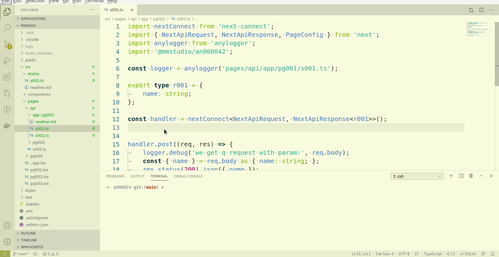

# 原子操作使用

## 查看原子操作文档

通过[查阅原子操作](../../index)，找到自己需要的原子操作，如`@mmstudio/an000048`

说明：

1. 初始引用原子操作会安装必要的依赖，根据网络和本机硬件情况可能会有不同程序的延迟，请耐心等待。
1. 在原子操作引用时，输入原子操作数字编号，可以快速定位该原子操作，对于经常使用的一些原子操作，这样的效率更高。
1. 插入原子操作的快捷键为`alt+t a`，其中`t`代表`template`,`a`则表示`atom`。

## 本地原子操作

如果在项目中实现了一个（或更多）原子操作，我们如何使用这个原子操作呢？以下为使用的示例：

