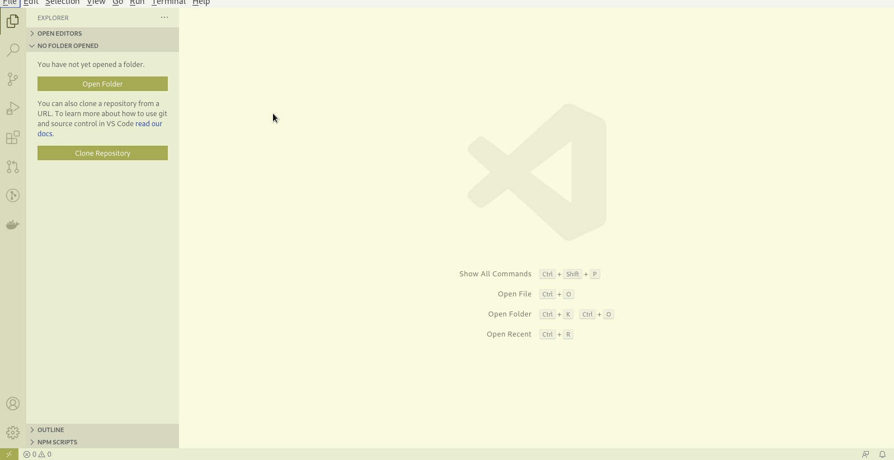
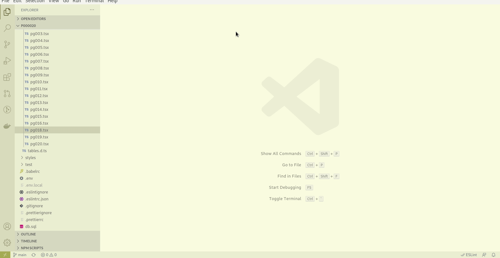

# vscode扩展安装

## 开发助手扩展

在扩展面板直接输入`mms`搜索扩展，然后点击安装即可完成扩展的安装。

## 代码错误提示扩展

[eslint](https://marketplace.visualstudio.com/items?itemName=dbaeumer.vscode-eslint)

## 扩展版本升级

正常情况下，启动vscode时是会自动检测版本升级。如果希望马上更新到最新版本，并且已经安装过该扩展，直接在扩展市场使用关键字检索（默认三个以上字符开始检索，两个以下字符不检索），如果已经安装过，会马上自动检测扩展的最新版本并升级，升级过程非常快，然后会提示重新打开vscode后生效。

## 回退/固定版本号

如果已安装的扩展在使用过程中出现问题，请及时向作者反馈，但在作者更新问题之前，可以采用回退到旧版本暂时解决该问题。具体操作如下:

以上演示了将扩展回退至版本4.0.0,并再次更新到最新版本的过程。
