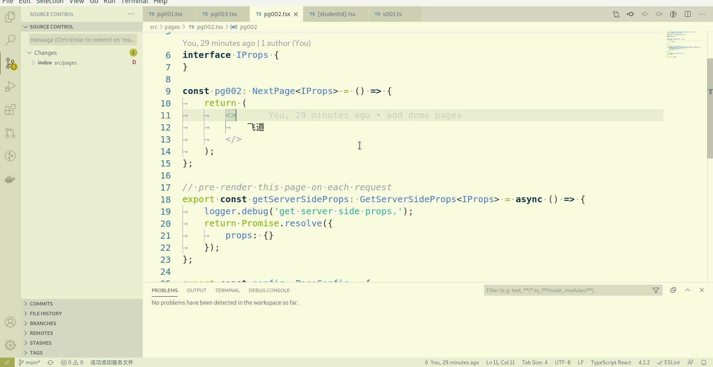

# web调用服务

<!-- TOC -->

- [1. 创建服务](#1-创建服务)
- [2. 调用服务](#2-调用服务)
- [3. 更多](#3-更多)
- [4. 示例代码](#4-示例代码)

<!-- /TOC -->

当我们遇到以下情况，就需要进行服务的调用了：

1. 需要完成数据交互。在浏览器中，为了数据安全，我们通常不会在客户端进行数据操作。
1. 同样是为了安全，一些与第三方（如微信）服务器的交互也不能在客户端进行
1. 限于客户端的局限性，有些事情无法在客户端完成，只能在服务器完成。如大量的计算。

## 1. 创建服务

当我们需要调用服务的时候，首先需要先创建一个服务，我们的服务创建可以遵循与页面名基本一致的原则，这样的项目维护的时候就比较容易找到被调用的服务代码。如果遇到有特殊的公共服务，可以单独提出来（这样的服务比较少，相对比较好找）。

在一个打开的页面文件中，使用代码助手的命令添加一个服务,我们这个服务将被我们之前添加的[客户端页面](./000017#31-客户端渲染页面实例)所调用。又因为在页面模板(pg001)中，已经添加过get请求的基本用法，所以这里我们模拟一个我们在项目中比较常用的post请求服务的写法。



提示：使用快捷键`alt+s`效率更高。

我们新建了一个post请求的服务，其地址为`/api/pg002/s001`,接收请求的参数为包含一个含有`name`属性的[json字符串](./000004)。处理完之后将这个name再次返回给调用者。

## 2. 调用服务

下面我们将在页面中调用它，通过`fetch`函数。细心的老师可能会发现，在创建服务时，已经在页面文件中自动添加了返回类型的引用`import { r001 } from './api/pg002/s001';`

接下来我们来调用刚才创建的服务.需要注意的是，页面的配置参数`amp`不能为`true`。有关`amp`的知识请大家自行查阅，这里不详细介绍。


我们在这个页面中，添加了一个输入框，让用户输入自己的名字，调用服务后，将服务返回的name使用alert弹窗提示给用户。

## 3. 更多

对于json格式的传参，我们可以在请求时添加一个请求头

```ts
const res = await fetch('/api/pg002/s001', {
	method: 'POST',
	body: JSON.stringify({
		name: inputname
	}),
	headers: {
		'Content-Type': 'application/json;charset=UTF-8'
	}
});
```

那么，在服务中，我们就不需要解析这个json字符串了:

```ts
handler.post((req, res) => {
	logger.debug('we get q request with param:', req.body);
	const { name } = req.body as { name: string; };
	res.status(200).json({ name });
});
```

这样，我们可以在调用处封装一个post请求的原子操作，原子操作中添加上这个请求头，然后在页面中调用这个原子操作，使用起来会更方便一些。关于原子操作的内容，后续章节会介绍.

## 4. 示例代码

示例代码在<https://github.com/mm-works/p000024>,有需要的老师请自取。
