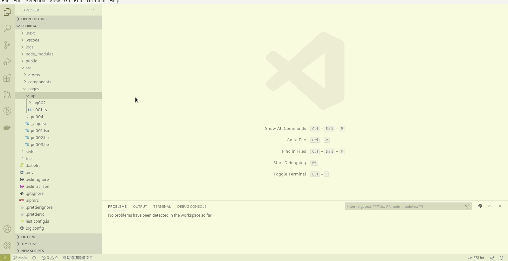

# app调用服务

<!-- TOC -->

- [1. 创建服务](#1-创建服务)
- [2. 完成服务逻辑](#2-完成服务逻辑)
- [3. 跨域请求](#3-跨域请求)
- [4. 调用服务](#4-调用服务)
- [5. 示例代码](#5-示例代码)

<!-- /TOC -->

## 1. 创建服务

因为app项目为纯前端项目，所以它并不能单独提供服务，服务由web项目提供。所以我们在开发app项目的时候，往往需要配套一个web项目，至少提供app需要的服务，但多数时候，我们同时也会需要一个web项目的。

我们为app端创建服务的时候在web项目中没有对应的page页面了，所以与[web服务的创建过程](./000019)稍有不同.如果web项目中有页面，请不要在打开这个页面文件的时候创建服务，那样，会将服务创建至该页面下，就不方便将不同端点的服务区分开了，造成代码维护的困难。

我们在创建第一个服务(示例中s001)的时候操作稍微有些复杂，需要先创建一个目录，比如我们把为app提供的服务都放置在`src/pages/api/app/`下，然后也根据不同页面让服务有一个分类，这样做的目的也是为了方便项目代码维护。后续再添加同一页面下的其它服务(示例中的s002)就可以可以一键完成。



提示：

1. 使用快捷键`alt+s`效率更高。
1. 巧用注释查找请参阅[使用注释查找文件](./000021)

## 2. 完成服务逻辑

我们接下来完成服务逻辑，为了演示方便，我们将其逻辑与[添加web服务](./000019#1-创建服务)的逻辑相同.

```ts
import nextConnect from 'next-connect';
import { NextApiRequest, NextApiResponse, PageConfig } from 'next';
import anylogger from 'anylogger';
import '@mmstudio/an000042';

const logger = anylogger('pages/api/app/pg001/s001.ts');

export type r001 = {
	name: string;
};

const handler = nextConnect<NextApiRequest, NextApiResponse<r001>>();

handler.get((req, res) => {
	logger.debug('we get q request with param:', req.body);
	const { name } = req.body as { name: string; };
	res.status(200).json({ name });
});

export const config = {} as PageConfig;

export default handler;
```

## 3. 跨域请求

由于在app上请求服务是跨域的，所以我们必须允许跨域请求，在app上才能访问到这个服务。


注意：

1. 在这个过程中，事实上我们讲解了如何添加项目级原子操作，以及引用这个原子操作的过程。
1. 有时候我们在使用api/原子操作的时候，可能会出现vscode误报语法错误的情况，这个时候重启vscode可以解决。简单的办法是按下`ctrl+shift+p`，输入`reload window`命令(通常并不需要全部输完就可以找到该命令)进行重启，会更方便快捷。
1. 这是一个已封装的原子操作，[使用原子操作](./000013)会更方便。

## 4. 调用服务

切换到app项目中，我们来完成对刚才服务的调用，这时我们需要用到taro封装的[api `request`](https://taro-docs.jd.com/taro/docs/apis/network/request/request)和两个表单组件：[Button](https://taro-docs.jd.com/taro/docs/components/forms/button)和[Input](https://taro-docs.jd.com/taro/docs/components/forms/input).


```ts
await request<{ name: string; }>({
	url: 'http://0.0.0.0:3000/api/app/pg002/s001',
	method: 'POST',
	dataType: 'json',
	credentials: 'include',
	data: {
		name
	},
	header: {
		'Content-Type': 'application/json;charset=UTF-8'
	}
});
```

注意：

1. 在开发过程中，可能还需要添加一项`credentials: 'include'`。
1. 往往我们需要将请求函数封装成为本地的一个原子操作，这样就不需要重复编码了,参见[示例代码](https://github.com/mm-works/p000025)。
1. 在进行开发时需注意，还是跨域的问题，请使用与浏览器打开页面相同的地址访问，通常会是`localhost`,`127.0.0.1`,`0.0.0.0`或是本机的物理ip地址。否则会遇到cookie相关问题。
1. 跨域问题只存在于h5或app（如微信）开发工具调试时，真机不存在此问题。

## 5. 示例代码

app端示例代码在<https://github.com/mm-works/p000025>，web服务端示例代码在<https://github.com/mm-works/p000024>,有需要的老师请自取。
