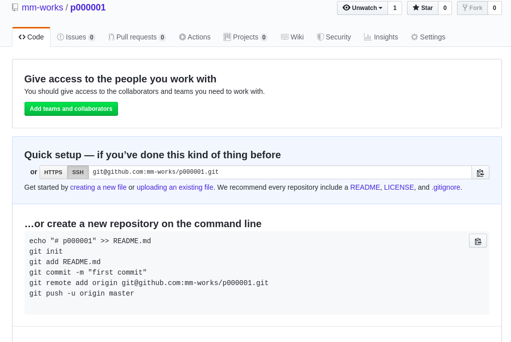
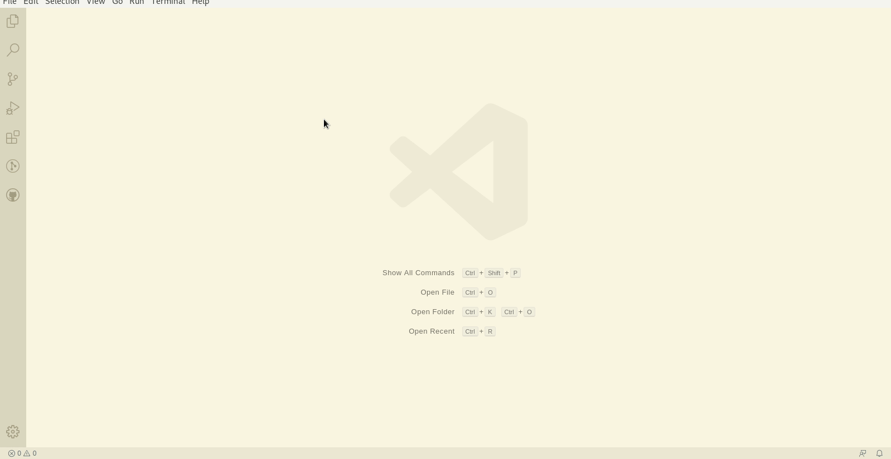
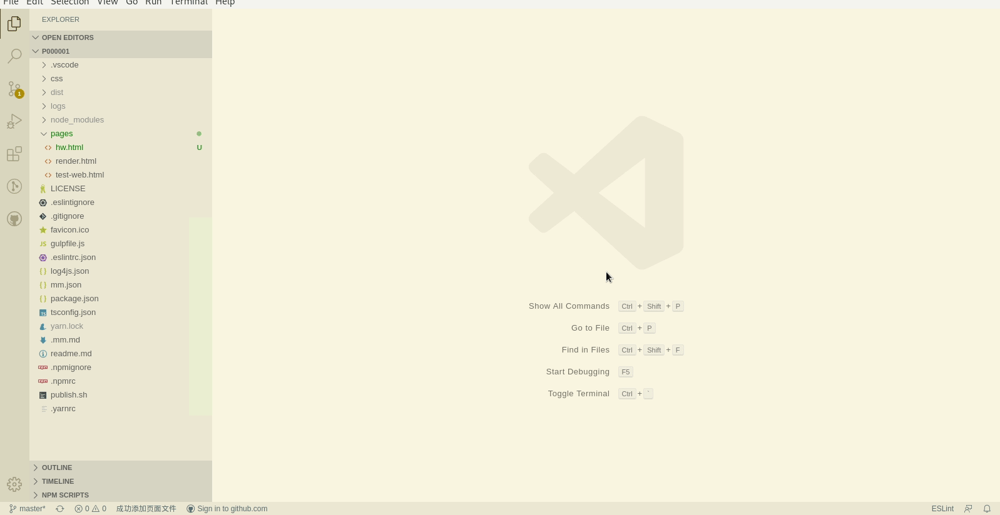

# Hello World

该项目完整代码位于[github](https://github.com/mm-works/p000001)

## 创建项目

学徒在github上创建好了一个空项目，地址为<https://github.com/mm-works/p000001>,刚创建好的项目看起来像这样

接下来学徒将使用[vscode插件mmstudio](https://marketplace.visualstudio.com/items?itemName=mm.mmstudio)创建项目。

按提示一步一步操作即可，项目编号学徒填写的是`1`，如果有多个项目，就可以使用数字一直编下去。如果写错了，在项目的package.json的name中修改。不同项目的编号必须不同，即package的name必须不同，这样，才能够使用npm（或类似的内建npm仓库）中发布为不同的包。

## 创建页面并开启调试

创建一个页面的过程非常简单,只需简单的几步

1. 创建好html静态页面，保存至项目下的`pages`目录下，可以使用任何html工具
1. 在vscode中运行创建页面命令，或使用快捷键(`alt+p`)
1. 选择静态页面
1. 运行调试命令,快捷键(`alt+m d`)

如下图所示：

小提示：快捷键`alt+m d`的做法是先按下`alt`键，然后按着`alt`不放的同时按下`m`键，然后同时放开这两个键，再按下`d`键。

## 打赏

