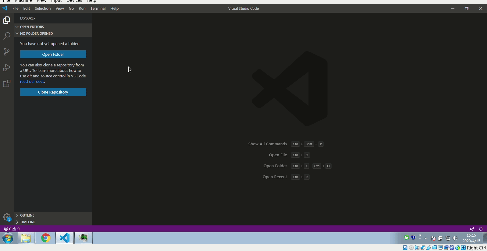

# Hello World

该项目完整代码位于[github](https://github.com/mm-works/p000003)

## 创建项目

创建项目过程类似[web端](../web/000001)，地址为<https://github.com/mm-works/p000003>.



小技巧：项目类型可以键盘输入`3`，快速选择。

## 创建页面

使用命令或快捷键(`alt+p`或`alt+c`)创建页面

## 设置调试页面

为了加速调试，在`src`目录下有两个文件需要注意:`src/app.json`和`src/app-debug.json`，其中，`src/app.json`在开发时不需要关心，只需在打包发布前将首要展示的页面地址放在前面即可。为了加速开发，在开发时可以修改`src/app-debug.json`,将调试所需的页面地址放进去，像下面这样：

```json
{
	"pages": [
		"pages/pg001/pg001"
	]
}
```

这样设计的好处是加快开发速度，我们在开发的时候通常可以只调试部分页面，这样就可以排除其它页面的干扰，调试页面时可以以最快的速度进入到被调试页面，从而加速页面的开发速度。

## 代码编辑

我们添加Hello World进`src/pg001/pg001.wxml`,修改其内容为：

```xml
<text>Hello mmstudio</text>
```

## 调试

与web端应用和app应用一样的调试的方法，使用命令或快捷键`alt+m d`即可开启或重启调试

与web端和app应用不同的是，我们必须使用微信提供的开发者工具进行项目的调试（我们需要用到它的真机调试，预览和发布功能），因为微信未提供Linux版本的开发者工具，所以我们不得不使用Windows进行微信小程序的开发和调试，配合gitbash和vscode，操作上几乎没有什么不同，只是开发效率相对会慢一些，这个事情没办法，人家的店大嘛。顺便说一句：使用wine的方法问题比较多，没点儿道行的人不要试了。

打开开发者工具，选择小程序开发，导入项目选择项目目录下生成的`develop`目录即可。

## 您的支持是我继续的动力


