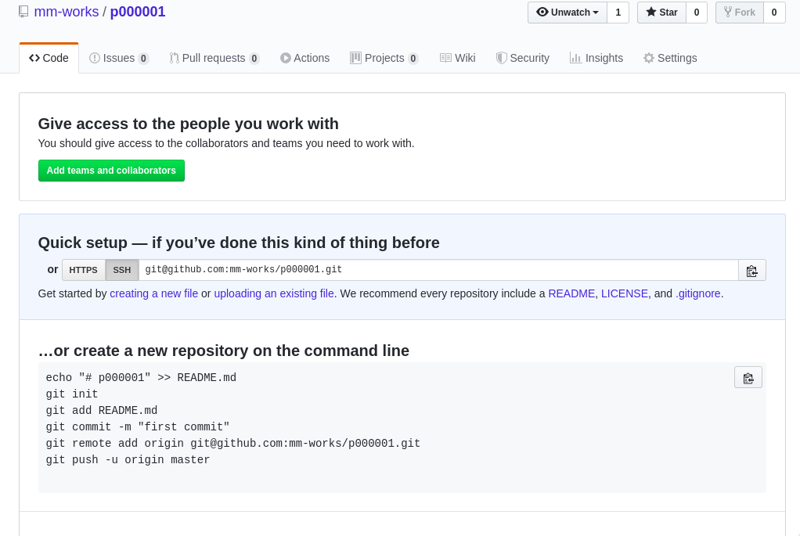

# Hello World

该项目完整代码位于[github](https://github.com/mm-works/p000001)

## 创建项目

学徒在github上创建好了一个空项目，地址为<https://github.com/mm-works/p000001>,刚创建好的项目看起来像这样

接下来学徒将使用[vscode插件mmstudio](https://marketplace.visualstudio.com/items?itemName=mm.mmstudio)创建项目。

按提示一步一步操作即可，项目编号学徒填写的是`1`，如果有多个项目，就可以使用数字一直编下去。如果写错了，在项目的package.json的name中修改。不同项目的编号必须不同，即package的name必须不同，这样，才能够使用npm（或类似的内建npm仓库）中发布为不同的包。

## 打赏

